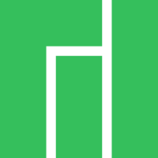
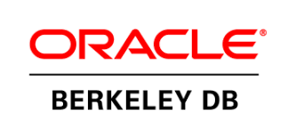
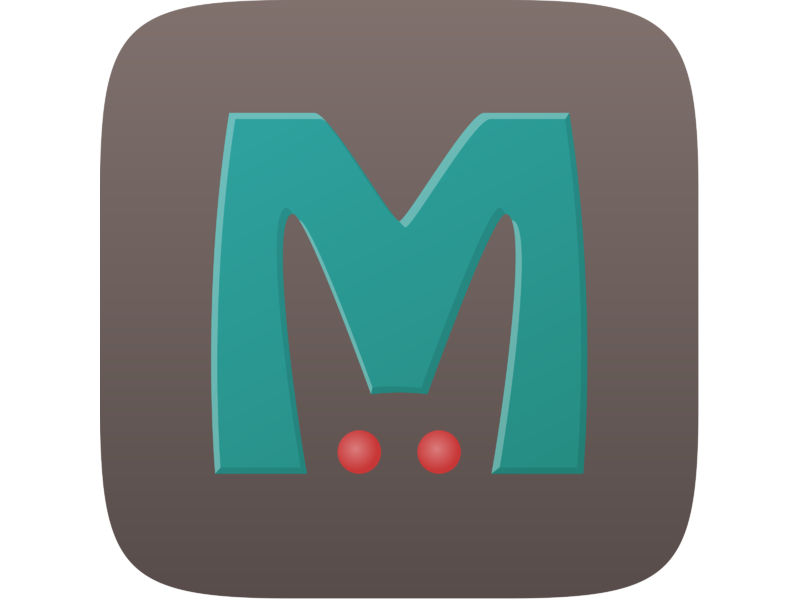

### Hi there :wave: 
## I'm [Konstantin S](https://www.linkedin.com/in/stan-sky/) and I'm software development engineer in test (SDET) from California :us:

### :angel: About me:

<!--
⚡ - I'm teaching [QA Automation](https://qasv.us/aboutqa) and [QA Manual](https://qasv.us/qamanual)💻 at our Online course [QA at Silicon Valley - QASV.US](https://qasv.us/)  

<table style="background-color:#FFFFE0;">
<tr style="background-color:#BDB76B;color:#ffffff;">
<th>Table Header</th><th>Table Header</th>
</tr>
<tr>
<td>Table cell 1</td><td>Table cell 2</td>
</tr>
<tr>
<td>Table cell 3</td><td>Table cell 4</td>
</tr>
</table>

#### My learn project
👋 - Feel free to join our FREE online Trial classes by submitting [this form](https://qasv.us/#form)  

🏆 - Also you could watch a lot of video about QA Testing on our [YouTube channel](https://www.youtube.com/SergeyEfremov_USA)  

✅ - Please check our [Telegram channel](https://t.me/qasvus) for tons of QA Testing vacancies in US
-->

#### Technical Skills and Favorite Tech

<table>
  <tr>
    <td align="center" Align Middle width="96">
        Operating systems
    </td>
    <td align="center" width="96">
      
       Linux
    </td>
    <td align="center" width="96">
      
       MacOS
    </td>
    <td align="center" width="96">
      
       Android
    </td>
    <td align="center" width="96">
      
       Windows
    </td>
    <td align="center" width="96">
      
       Manjaro
    </td>
    <td align="center" width="96">
      
       Ubuntu
    </td>
    <td align="center" width="96">
      
       Debian
    </td>
  </tr>
  <tr>
    <td align="center" valign="center" width="100"> 
       Programming languages
    </td>
    <td align="center" width="96">
      
       Python
    </td>
    <td align="center"  width="96">
      
       JavaScript
    </td>
    <td align="center"  width="96">
      
       Perl
    </td>
    <td align="center" width="96">
      
       
    </td>
    <td align="center"  width="96">
      
       Bash
    </td>
    <td align="center" width="96">
      
       
    </td>
    <td align="center" width="96">
      
       
    </td>
    <td align="center" width="96">
      
       
    </td>
  </tr>
  <tr>
    <td align="center" Align Middle width="96">
       SQL  &  NoSQL Databases
    </td>
    <td align="center"  width="96">
      
       PostgreSQL
     <td align="center"  width="96">
        
         MySQL
     </td>
      <td align="center"  width="96">
        
         SQLite
     </td>
      <td align="center"  width="96">
        
         MariaDB
     </td>
      <td align="center"  width="96">
        
         BerkleyDB
     </td>
      <td align="center"  width="96">
        
         MongoDB
     </td>
      <td align="center"  width="96">
        
         Redis
     </td>
      <td align="center"  width="96">
        
         Memcached
     </td>
  </tr>
  <tr>
    <td align="center" Align Middle width="96">
       IDEs  &  Text Editors
    </td>
    <td align="center"  width="96">
       
        Vim
    </td>
    <td align="center"  width="96">
       
        PyCharm
    </td>
        <td align="center"  width="96">
       
        WebStorm
    </td>
    <td align="center"  width="96">
       
        VSCode
    </td>
        <td align="center"  width="96">
       
        Atom
    </td>
        <td align="center"  width="96">
       
        Sublime
    </td>
  </tr>
</table>

<!--

- OS: 
- Languages: JavaScript, Typescript, Python, R;
- Technologies: ReactJS, NodeJS, ReactNative, HTML(5), CSS(3), jQuery, VueJS, Angular;
- Libs: Redux, Redux Saga/Thunk, Lodash, D3, HighCharts, Jest, Mocka, Enzyme, Flow, Bootstrap; - Tools: Git, yarn/npm, Webpack, Gulp, Babel, Prettier, VSCode;
- Databases: MongoDB, SQL;

#### My favorite (QA and programming related) quotes: 
> - Everything is easy, when you know how to do this.  
> - Don't talk, just try to do.
<!--
**KonstantinSKY/KonstantinSKY** is a ✨ _special_ ✨ repository because its `README.md` (this file) appears on your GitHub profile.

Here are some ideas to get you started:

- 🔭 I’m currently working on ...
- 🌱 I’m currently learning ...
- 👯 I’m looking to collaborate on ...
- 🤔 I’m looking for help with ...
- 💬 Ask me about ...
- 📫 How to reach me: ...
- 😄 Pronouns: ...
- ⚡ Fun fact: ...
-->
